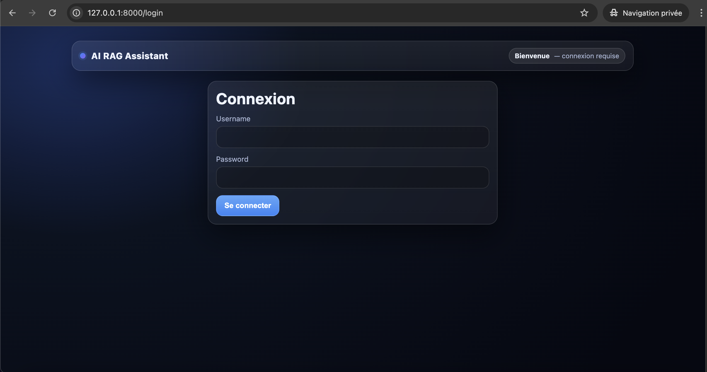
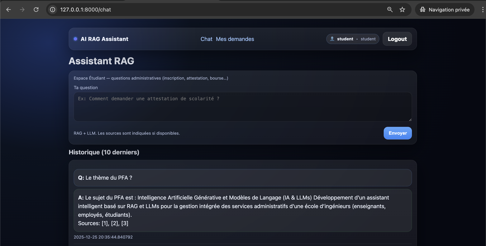
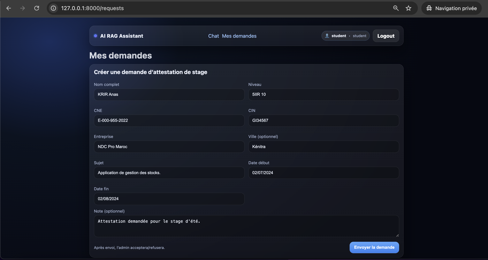
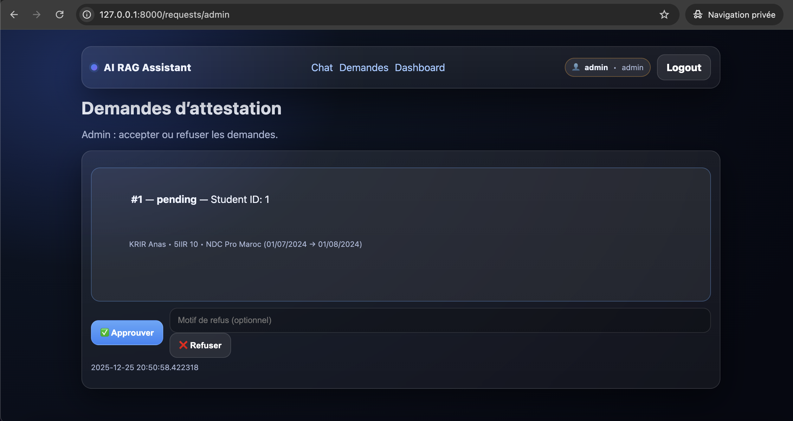
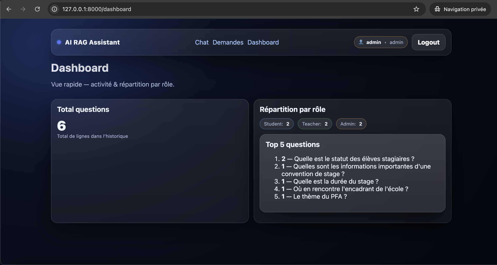
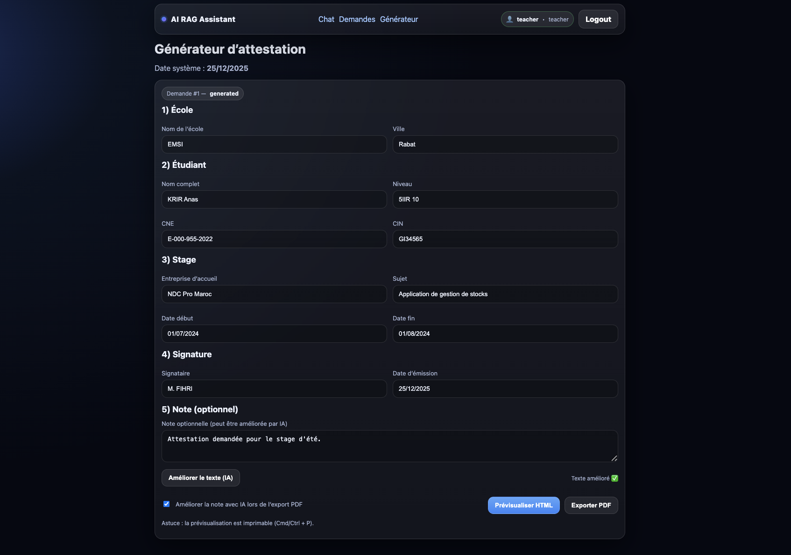

# 🤖 PFA — Assistant Administratif Intelligent (RAG + LLMs) pour une école d’ingénieurs


-orange)


**PFA " Projet de fin d'année " — Assistant RAG** est un prototype (MVP) d’assistant administratif **basé sur RAG + LLMs** pour une **gestion intégrée des services** d’une école d’ingénieurs (**étudiants / enseignants / administration**).

Objectif : **centraliser** les documents (PDF) et permettre de **poser des questions en langage naturel**, avec **rôles**, **historique**, **dashboard**, et **génération de documents**.

---

## 📌 Sommaire

1. [Fonctionnalités](#-fonctionnalités)
2. [Stack technique](#-stack-technique)
3. [Aperçu (screenshots)](#-aperçu-screenshots)
4. [Architecture & organisation du code](#-architecture--organisation-du-code)
5. [Démarrage rapide](#-démarrage-rapide)
   - [1️⃣ Prérequis](#1️⃣-prérequis)
   - [2️⃣ Installer & configurer](#2️⃣-installer--configurer)
   - [3️⃣ Ingestion des PDFs](#3️⃣-ingestion-des-pdfs)
   - [4️⃣ Lancer le serveur LLM (optionnel)](#4️⃣-lancer-le-serveur-llm-optionnel)
   - [5️⃣ Lancer l’app](#5️⃣-lancer-lapp)
6. [Comptes de démonstration](#-comptes-de-démonstration)
7. [Endpoints principaux](#-endpoints-principaux)
8. [Roadmap](#-roadmap)
9. [Auteurs](#-auteurs)
10. [Licence](#-licence)

---

## ✅ Fonctionnalités

### 🔎 RAG sur documents PDF <br/>
- Ingestion de PDFs : extraction → découpage en chunks → embeddings → sauvegarde (metadata + embeddings). <br/>
- Recherche top-k (cosine) et génération de réponse. <br/>
- Citations “Sources: [1], [2]…” si disponibles. <br/>

> Note (MVP) : la sortie est stockée dans `data/faiss_index/` (embeddings + metadata).   <br/>
> Le remplacement par une vraie base vectorielle FAISS/Pinecone/Milvus est une amélioration facile. <br/>

### 👥 Interface web selon le rôle (HTML/Jinja2) <br/>
- **Étudiant** : chat + demandes d’attestation (workflow). <br/>
- **Enseignant** : chat + consultation des demandes (ex: suivi/lecture selon besoin). <br/>
- **Admin** : chat + dashboard + gestion/validation des demandes. <br/>

### 🔐 Authentification & rôles (simple) <br/>
- Login par formulaire. <br/>
- Session via cookie HTTPOnly. <br/>
- 3 rôles : `student`, `teacher`, `admin`. <br/>

### 🧾 Générateur de documents <br/>
- Génération d’une **attestation** via template. <br/>
- Export **PDF** (ReportLab). <br/>
- Option “Améliorer le texte” via LLM **si disponible**. <br/>

### 📊 Mini dashboard (admin) <br/>
- Total questions (historique). <br/>
- Répartition par rôle. <br/>
- Top questions. <br/>

---

## 🛠️ Stack technique

| Élément | Choix  | Rôle |
|---|---|---|
| Backend | **Python + FastAPI** | Routes web + pages HTML |
| Templates | **Jinja2** | UI simple (gain de temps) |
| DB | **SQLite + SQLAlchemy** | Users, logs, demandes |
| Embeddings | **sentence-transformers** | Vectorisation locale (sans clé) |
| Vector store | **MVP: embeddings.npy + cosine** | Récupération top-k |
| LLM | **llama.cpp server (optionnel)** | Réponses plus naturelles + amélioration texte |
| PDF export | **ReportLab** | Génération attestation PDF |
| IDE | VS Code | Dev sur macOS |

---

## 🖼️ Aperçu (screenshots)


| Login | Chat | Demandes étudiant |
|---|---|---|
|  |  |  |

| Demandes admin | Dashboard | Générateur |
|---|---|---|
|  |  |  |

---

## 🏗️ Architecture & organisation du code

Structure (simplifiée) :

```
pfa-rag-assistant/
├─ app/
│  ├─ main.py # routes FastAPI + pages
│  ├─ auth.py # login, rôles, cookie session
│  └─ rag.py # retrieval + prompt + appel llama.cpp (optionnel)
│  └─ ingest.py # extraction PDF + chunks + embeddings
│  └─ db.py # SQLAlchemy models + SQLite
│  └─ docgen.py # génération attestation (HTML preview + PDF)
│  └─ templates/ # pages Jinja2
│  └─ static/ # style.css
│
├─ data/
│  ├─ docs/ # PDFs à indexer (non versionner si sensibles)
│  ├─ faiss_index/ # meta.jsonl + embeddings.npy (généré)
│
├─ img/ # Aperçu (interfaces de l'App)
│
├─ requirements.txt
├─ .gitignore
│
└─ README.md
```


---

## 🚀 Démarrage rapide

### 1️⃣ Prérequis

- Python **3+** <br/>
- macOS / Linux / Windows <br/>
- (Optionnel) **llama.cpp** installé si tu veux des réponses “LLM”. <br/>

### 2️⃣ Installer & configurer

```
git clone https://github.com/AnasKrir/pfa-rag-assistant.git
cd pfa-rag-assistant

python -m venv .venv
source .venv/bin/activate
pip install -r requirements.txt
```

### 3️⃣ Ingestion des PDFs

- Mets tes documents dans data/docs/ (PDF). <br/>
- Lance l’ingestion : <br/>

```
python -m app.ingest
```

- Résultat : data/faiss_index/meta.jsonl + data/faiss_index/embeddings.npy. <br/>

### 4️⃣ Lancer le serveur LLM (optionnel)

Exemple (llama.cpp server) : <br/>

```
pkill -f "llama-server"
llama-server -m ~/llm/mistral.gguf --port 8080 --ctx-size 1024 -t 2 --parallel 1
```

### 5️⃣ Lancer l’app

```
# (optionnel) reset DB
rm -f app/app.db

uvicorn app.main:app --host 127.0.0.1 --port 8000 --reload --workers 1
```

- Puis ouvrir : <br/>

**👉🏻 http://127.0.0.1:8000/login** <br/>


---


## 🔑 Comptes de démonstration

- student / student123 <br/>
- teacher / teacher123 <br/>
- admin / admin123 <br/>


---


## 🌐 Endpoints principaux

- /login : connexion <br/>
- /chat : chat RAG <br/>
- /requests : demandes étudiant <br/>
- /requests/admin : validation admin (approve/refuse) <br/>
- /requests/teacher : vue enseignant <br/>
- /dashboard : stats (admin) <br/>
- /generate : générateur attestation (preview / improve / pdf) <br/>


---


## 🗺️ Roadmap 📈

✅ Remplacer la recherche cosine par un index FAISS complet (scalable). <br/>
✅ Ajouter MySQL (prod) + migrations (Alembic). <br/>
✅ RBAC avancé (direction, RH, scolarité…) <br/>
✅ Évaluation RAG (jeux de tests, métriques, traçabilité sources). <br/>
✅ Sécurité : chiffrement, audit logs, anonymisation, RGPD. <br/>


---


## 👥 Auteurs

KRIR Anas — Développement backend, RAG, UI <br/>
EL YOURI Adam — UI/UX & intégration <br/>


---

 ## 📄 Licence

Projet sous licence MIT. <br/>
✅ Libre d’utiliser, modifier, distribuer.

© 2025 — KRIR Anas & EL YOURI Adam <br/>

---